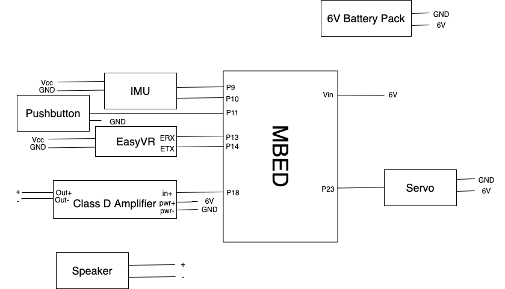

# Automatic Mask
ECE 4180 Fall 2021 Final Project

Click the picture for demo video
## Author 
Ruirui Ma, Haotian Sheng

# Overview
Coronavirus, with a multitude of variants, is a extremely contagious and deadly respitory disease. Thus, masks have become essential in protecting one's health in this global pandemic. However, masks can be inconvenient at times. For example, when one wants a breath of fresh air when there's no one around, or when one want to drink and eat, one needs to take off and put on the mask. This is not only inconvenient, but also dangerous to one's health as he or she needs to use oftentimes unsanitized hands to touch the mask, potentially bringing the virus to the mask.

Thus, we have created a mask that can automatically cover/ uncover facial area for our ECE 4180 Embedded System Design final project. The mask can be controlled through the following options:
* Push the button the turn on or off the mask
* Speak to the microphone through either UP or DOWN command to turn on or off the mask
* Sneeze to turn on the mask

# Parts Used
Software Used
* C
* RTOS

Hardware Used
* Mbed LPC1768 
* LSM9DS1 IMU Breakout Board
* Any RC Servo (HITEC HS-322HD)
* Pushbutton
* EasyVR -- Voice Recognition
* Speaker and Class D Amplifier

# Connection Diagram

# Instruction
After connecting all wires and modules with Mbed, you can download our source file to test the function of each module. If you wish to alter any parts or add functions, you can reach the following library posted on Mbed website for more information on each parts:

- [IMU](https://os.mbed.com/components/LSM9DS1-IMU/)
- [RC Servo](https://os.mbed.com/users/4180_1/notebook/an-introduction-to-servos/)
- [Speaker & Class D Amplifier](https://os.mbed.com/users/4180_1/notebook/using-a-speaker-for-audio-output/)
- [EasyVR](https://os.mbed.com/users/4180_1/notebook/easyvr/)

